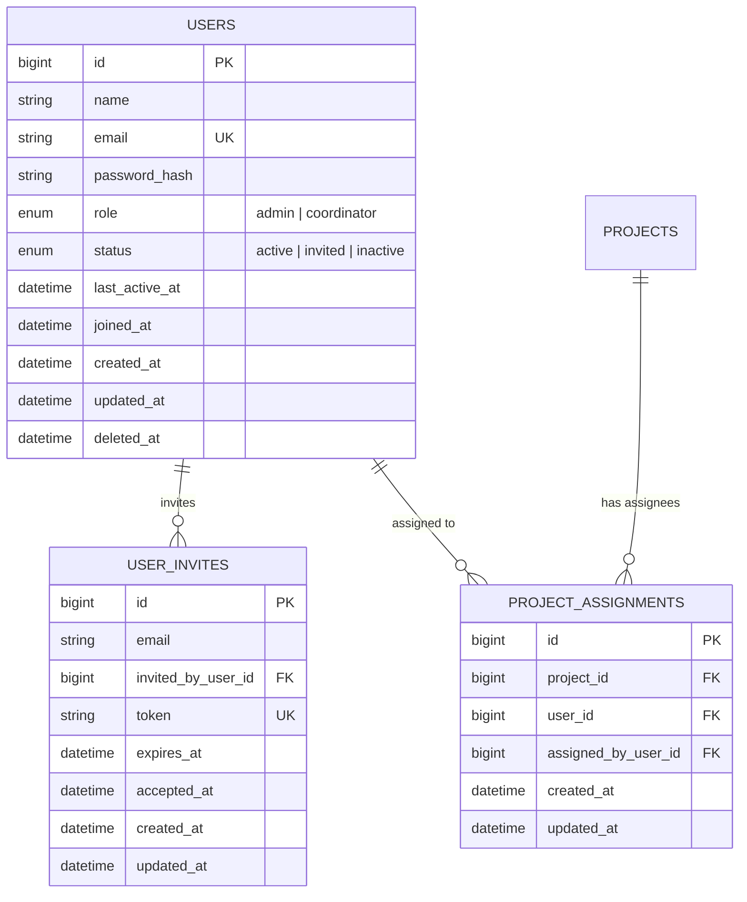
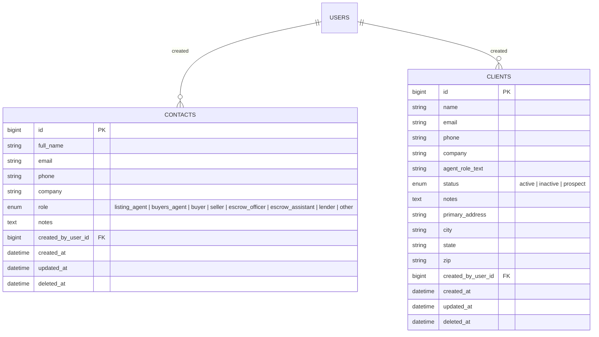
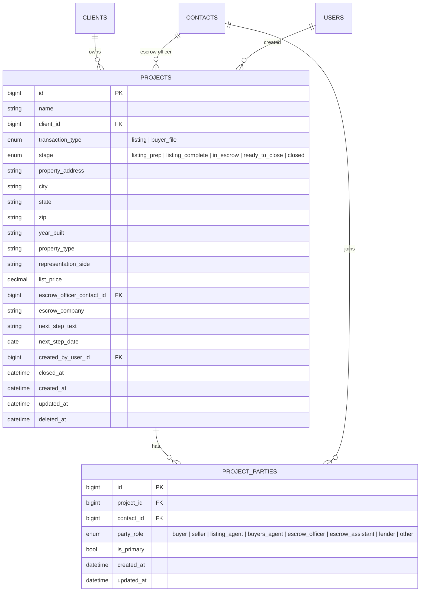
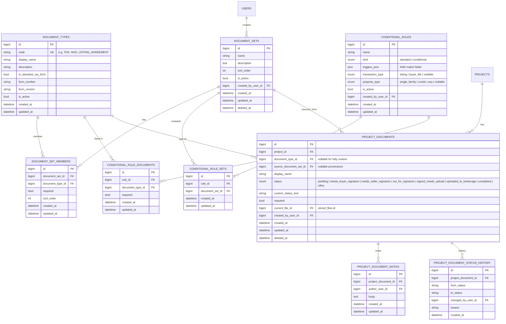
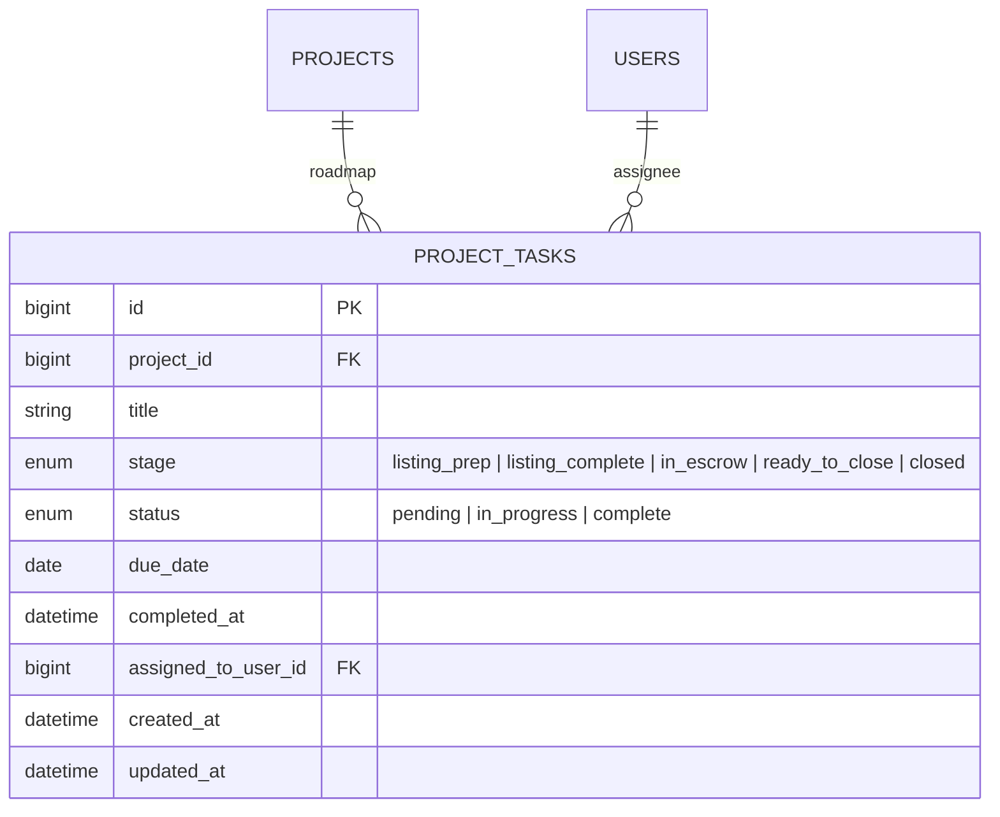
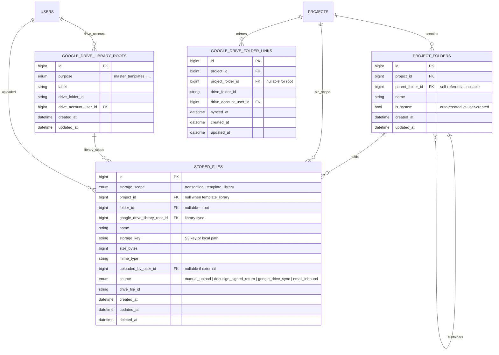
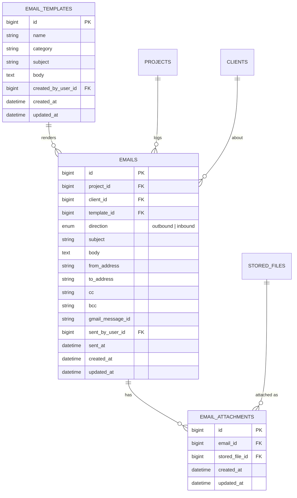
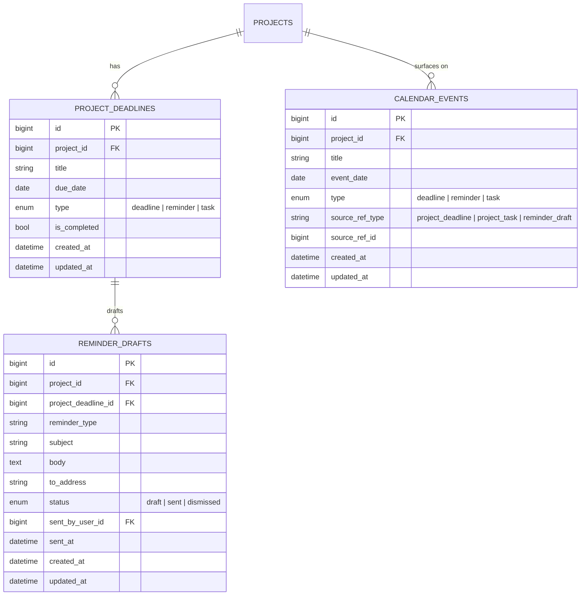
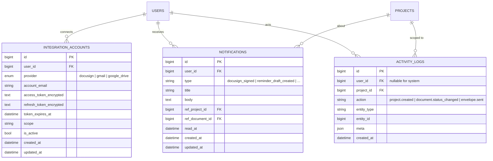

# Kathryn Portal — Database Schema (Visualization)

> Phase 1 schema for the Real Estate Transaction Management Portal.
>
> **Schema version:** `1.1.0` (see `schema.json` `meta` in this folder). Product intent: `Docs/product-summary.md` (from repo root).
>
> Diagrams below are **Mermaid ERD**. They render natively in GitHub, VS Code markdown preview, and Cursor markdown preview.
>
> Conventions:
> - `snake_case`, plural table names
> - every table: `id` (PK), `created_at`, `updated_at`
> - `deleted_at` where soft delete is useful
> - FK names follow `<table_singular>_id`
> - PK = Primary Key · FK = Foreign Key · UK = Unique Key

---

## 0. Domain overview (master map)

```mermaid
erDiagram
    USERS ||--o{ PROJECT_ASSIGNMENTS : "works"
    USERS ||--o{ INTEGRATION_ACCOUNTS : "connects"
    USERS ||--o{ NOTIFICATIONS : "receives"
    USERS ||--o{ ACTIVITY_LOGS : "acts"

    CLIENTS ||--o{ PROJECTS : "owns"
    CONTACTS ||--o{ PROJECT_PARTIES : "is party in"
    PROJECTS ||--o{ PROJECT_PARTIES : "has parties"
    PROJECTS ||--o{ PROJECT_ASSIGNMENTS : "assigned to"

    PROJECTS ||--o{ PROJECT_DOCUMENTS : "has"
    PROJECTS ||--o{ PROJECT_FOLDERS : "organizes"
    PROJECTS ||--o{ STORED_FILES : "txn_files"
    PROJECTS ||--o{ PROJECT_TASKS : "has"
    PROJECTS ||--o{ PROJECT_DEADLINES : "has"
    PROJECTS ||--o{ EMAILS : "logs"
    PROJECTS ||--o{ DOCUSIGN_ENVELOPES : "sends"
    PROJECTS ||--o{ GOOGLE_DRIVE_FOLDER_LINKS : "mirrors"

    DOCUMENT_TYPES ||--o{ PROJECT_DOCUMENTS : "instance of"
    DOCUMENT_TYPES ||--|| DOCUSIGN_TEMPLATES : "template for"
    DOCUSIGN_TEMPLATES ||--o{ DOCUSIGN_TEMPLATE_FIELDS : "field coords"

    DOCUMENT_SETS ||--o{ DOCUMENT_SET_MEMBERS : "contains"
    DOCUMENT_TYPES ||--o{ DOCUMENT_SET_MEMBERS : "in_set"
    CONDITIONAL_RULES ||--o{ CONDITIONAL_RULE_SETS : "applies_sets"
    DOCUMENT_SETS ||--o{ CONDITIONAL_RULE_SETS : "via_rule"
    DOCUMENT_SETS ||--o{ PROJECT_DOCUMENTS : "checklist_source"

    CONDITIONAL_RULES ||--o{ CONDITIONAL_RULE_DOCUMENTS : "requires"
    DOCUMENT_TYPES  ||--o{ CONDITIONAL_RULE_DOCUMENTS : "included in"

    GOOGLE_DRIVE_LIBRARY_ROOTS ||--o{ STORED_FILES : "library_files"
    USERS ||--o{ GOOGLE_DRIVE_LIBRARY_ROOTS : "owns_drive_root"

    DOCUSIGN_ENVELOPES ||--o{ DOCUSIGN_ENVELOPE_DOCUMENTS : "bundles"
    DOCUSIGN_ENVELOPES ||--o{ DOCUSIGN_ENVELOPE_RECIPIENTS : "routes to"
    DOCUSIGN_ENVELOPES ||--o{ DOCUSIGN_WEBHOOK_EVENTS : "callbacks"
    PROJECT_DOCUMENTS  ||--o{ DOCUSIGN_ENVELOPE_DOCUMENTS : "sent in"

    EMAIL_TEMPLATES ||--o{ EMAILS : "renders"
    EMAILS ||--o{ EMAIL_ATTACHMENTS : "has"
    STORED_FILES ||--o{ EMAIL_ATTACHMENTS : "attached as"

    PROJECT_DEADLINES ||--o{ REMINDER_DRAFTS : "triggers"
    PROJECTS ||--o{ CALENDAR_EVENTS : "surfaces on"
```



---

## 1. Authentication & team



---

## 2. Contacts directory + clients



> Note: `clients` ≈ agents Kathryn repeatedly works for.
> `contacts` = everyone else (buyers, sellers, escrow, lenders). Can be unified into one table later with an `is_client` flag if preferred.

---

## 3. Projects / transactions (core)



---

## 4. Document checklist (smart / conditional)



---

## 5. Tasks



---

## 6. File storage + folder system



---

## 7. DocuSign template engine (core automation)

```mermaid
erDiagram
    DOCUSIGN_TEMPLATES {
        bigint id PK
        bigint document_type_id FK UK
        string docusign_template_id "external"
        bigint pdf_reference_file_id FK "stored_files.id"
        int    version
        bigint created_by_user_id FK
        datetime created_at
        datetime updated_at
    }

    DOCUSIGN_TEMPLATE_FIELDS {
        bigint id PK
        bigint template_id FK
        enum   role "seller | buyer | listing_agent | buyers_agent | escrow_officer | other"
        enum   field_type "signature | initial | date | text | checkbox"
        int    page_number
        float  x_anchor
        float  y_anchor
        float  width
        float  height
        string anchor_string "alternative to x/y"
        bool   is_required
        datetime created_at
        datetime updated_at
    }

    DOCUSIGN_ENVELOPES {
        bigint id PK
        bigint project_id FK
        string docusign_envelope_id "external"
        enum   status "created | sent | delivered | completed | declined | voided"
        bigint sent_by_user_id FK
        datetime sent_at
        datetime completed_at
        datetime created_at
        datetime updated_at
    }

    DOCUSIGN_ENVELOPE_DOCUMENTS {
        bigint id PK
        bigint envelope_id FK
        bigint project_document_id FK
        bigint template_id FK "nullable for non-standard"
        datetime created_at
        datetime updated_at
    }

    DOCUSIGN_ENVELOPE_RECIPIENTS {
        bigint id PK
        bigint envelope_id FK
        bigint contact_id FK "nullable for ad-hoc"
        string email
        string name
        enum   role "seller | buyer | listing_agent | buyers_agent | escrow_officer | other"
        int    routing_order
        enum   status "created | sent | delivered | signed | declined"
        datetime signed_at
        datetime created_at
        datetime updated_at
    }

    DOCUSIGN_WEBHOOK_EVENTS {
        bigint id PK
        bigint envelope_id FK
        string event_type
        json   raw_payload
        datetime received_at
        datetime created_at
    }

    DOCUMENT_TYPES      ||--|| DOCUSIGN_TEMPLATES            : "has template"
    DOCUSIGN_TEMPLATES  ||--o{ DOCUSIGN_TEMPLATE_FIELDS      : "fields"
    STORED_FILES        ||--o{ DOCUSIGN_TEMPLATES            : "reference pdf"

    PROJECTS            ||--o{ DOCUSIGN_ENVELOPES            : "sends"
    DOCUSIGN_ENVELOPES  ||--o{ DOCUSIGN_ENVELOPE_DOCUMENTS   : "bundles"
    DOCUSIGN_ENVELOPES  ||--o{ DOCUSIGN_ENVELOPE_RECIPIENTS  : "routes"
    DOCUSIGN_ENVELOPES  ||--o{ DOCUSIGN_WEBHOOK_EVENTS       : "callbacks"

    PROJECT_DOCUMENTS   ||--o{ DOCUSIGN_ENVELOPE_DOCUMENTS   : "included in"
    DOCUSIGN_TEMPLATES  ||--o{ DOCUSIGN_ENVELOPE_DOCUMENTS   : "applied"
    CONTACTS            ||--o{ DOCUSIGN_ENVELOPE_RECIPIENTS  : "recipient"
```

---

## 8. Email (Gmail + templates + logs)



---

## 9. Deadlines · reminders · calendar



> `calendar_events` can be implemented as a **view** unioning deadlines + tasks + reminder_drafts if you prefer not to store duplicate rows.

---

## 10. Integrations · notifications · audit



---

## Design decisions to lock before coding migrations

1. **Unify `clients` + `contacts`?** Single `contacts` table + `is_client` flag is cleaner long-term; two tables match existing frontend more directly.
2. **Where do files physically live?** Local disk vs S3/compatible vs always in Drive — changes the meaning of `stored_files.storage_key`.
3. **Version history for documents?** Current schema has 1:1 `project_documents.current_file_id`. If you need full version history, add a `project_document_files` join table and keep `current_file_id` as a pointer to the latest.
4. **`calendar_events` as table vs view?** A view keeps data DRY; a table is easier to index and filter in API layer.
5. **Address normalization?** Currently addresses are stored as strings on `projects`, `clients`, `contacts`. Can later extract into an `addresses` table if needed.
6. **Soft delete depth?** Only on meaningful entities (clients, projects, documents, stored files, users). Avoid on logs/history tables.
7. **Document sets vs one row per type in rules?** v1.1 uses `document_sets` + `document_set_members` (M:N) and `conditional_rule_sets` so the same `document_type` can appear in multiple sets; rules merge sets. Inline extras remain on `conditional_rule_documents`.

---

## Minimum subset to run the current frontend (if you want a smaller start)

If you want to wire up the existing `mockData.ts`-based UI first with the minimum schema:

- `users`
- `clients`
- `contacts`
- `projects`
- `project_parties`
- `document_types`
- `document_sets` + `document_set_members`
- `conditional_rules` + `conditional_rule_sets` + `conditional_rule_documents`
- `project_documents` + `project_document_notes`
- `project_tasks`
- `project_deadlines`
- `stored_files` + `project_folders`
- `email_templates` + `emails`
- `reminder_drafts`

DocuSign / Gmail / Drive / notifications / audit can be added in a second migration once the UI is backed by real data.
